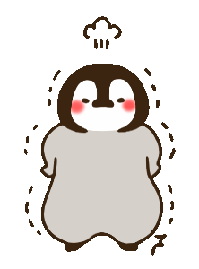

用过`iphone`的都知道,`ios`系统有一个重要的功能——辅助触控,可以让我们在触摸屏幕有困难或需要自适应配件的情况下使用`iphone`.

辅助触控中,悬浮球充当着重要角色,它置顶悬浮在屏幕边缘,可任意移动,既不影响用户正常操作系统,又能提供许多功能的快速入口.

实际上,在很多`app`我们也能看到类似的交互,例如微信前几个版本的浮窗效果.

那么原生`js`怎么实现这一交互效果呢?

# 实现思路

1. 实现悬浮球的拖拽,原理是改变球的位置.如果以绝对定位`(position: absolute)`的方式来决定小球的位置,那么关键就是计算和改变`top`和`left`属性;

2. 手指触屏有三个关键事件:

   - `touchstart`:触屏时触发事件
   - `touchmove`:在屏幕上移动触发事件
   - `touchend`:手指离开屏幕触发事件

   三个事件都接受`event`参数,我们通常使用这个参数拿到当前的触屏点,并获取有关信息(如当前触屏点距离屏幕边缘的距离)

3. 如下图,小球从`A`点拖动到`B`点(暂且先只考虑水平方向的拖动,垂直方向是同理的),我们已知的信息有

   - `x1 = e.targetTouches[0].clientX`,即触屏点`A`到屏幕左边缘的距离;
   - `l1 = ball.offsetLeft`,即小球在`A`点时的左偏移量;
   - `x2 = e.targetTouches[0].clientX`,即触屏点`B`到屏幕左边缘的距离;

   那么,关键就是求得小球在`B`点时的左偏移量`l2`,很简单的距离差运算,可得`l2 = x2 - (x1 - l1)`;

   

4. 再将小球的样式属性`left`设置为`l2`,实现了小球位置的改变.

   ```js
   this.style.left = l2 + 'px';
   ```

5. 将小球拖动到某个位置松开,有以下几种情况:

   ```js
   const ballWidth = this.offsetWidth; // 悬浮球宽度
   const ballHeight = this.offsetHeight; // 悬浮球高度
   const l = this.offsetLeft; // 手指离开屏幕时悬浮球左偏移量
   const h = this.offsetTop; // 手指离开屏幕时悬浮球上偏移量
   const clientWidth = document.documentElement.clientWidth; // 屏幕宽度
   const clientHeight = document.documentElement.clientHeight; // 屏幕高度
   ```

   - 小球移出屏幕左侧,松开时弹回最左

     ```js
     if (l <= 0) { this.style.left = 0 + 'px'; }
     ```

   - 小球移出屏幕右侧,松开时弹回最右

     ```js
     if (l >= clientWidth - ballWidth) {
         this.style.left = clientWidth - ballWidth + 'px';
     }
     ```

   - 悬浮球移出屏幕顶部,松开时弹回最顶部

     ```js
     if (h <= 0) {
     	this.style.top = 0;
     }
     ```

   - 悬浮球移出屏幕底部,松开时弹回最底部

     ```js
     if (h >= clientHeight - ballHeight) {
     	this.style.top = clientHeight - ballHeight + 'px';
     }
     ```

   - 悬浮球在屏幕范围内松开,未移过屏幕二分之一的宽度,弹回最左,否则弹回最右

     ```js
     if (l <= (clientWidth - ballWidth) / 2) {
         this.style.left = 0 + 'px';
      } else {
        this.style.left = clientWidth - ballWidth + 'px';
     }
     ```

6. 为小球弹回添加过渡效果`(transition)`,使其弹回效果更加平滑,提升交互体验.但是需要注意,小球在拖动的过程中,不需要有过渡.因此,我们只需要在`touchend`事件中添加`transition`样式(保证弹回时有过渡效果)

   ```js
   this.style.transition = 'all 0.3s ease';
   ```

   并在`touchstart`事件中把过渡效果删除:

   ```js
   this.style.transition = 'none';
   ```

7. 我们还可以在`touchend`事件中添加定时器,让小球在未操作的情况下,`3s`后自动变半透明:

   ```js
   ball.timer = setTimeout(() => {
       this.style.opacity = 0.5;
   }, 3000);
   ```

   当然,在`touchstart`事件中,需要把透明度改回来,并删除定时器(否则会造成内存泄露)

   ```js
   this.style.opacity = 1;
   clearTimeout(this.timer);
   ```

8. 实际应用中,悬浮球的下面往往是我们正常页面的业务操作,因此,需要为`touchstart,touchmove,touchend`事件添加阻止事件冒泡:

   ```js
   e.stopPropagation();
   ```

9. 我们还可以对拖动事件`touchmove`做一个节流处理,实现性能上的小优化.

   ```js
   // 节流函数
   function throttle(fn, interval, _this) {
       let lastTime = 0;
       // tslint:disable-next-line:only-arrow-functions
       return function(...args) {
           const nowTime = +new Date();
           if (nowTime - lastTime >= interval) {
               fn.apply(_this, args);
               lastTime = nowTime;
           }
       };
   }
   ```

   ```js
   const ballMove = function(e) {
       e.stopPropagation();
   	// touchmove事件的逻辑代码, 此处省略
   };
   
   ball.addEventListener('touchmove', function(e) {
       if (!this.fn) {
           this.fn = throttle(ballMove, 10, this);
           this.fn(e);
       } else {
           this.fn(e);
       }
   });
   ```

   

# 完整代码

```html
<!DOCTYPE html>
<html lang="en">
<head>
    <meta charset="UTF-8">
    <meta http-equiv="X-UA-Compatible" content="IE=edge">
    <meta name="viewport" content="width=device-width, initial-scale=1.0">
    <title>Document</title>
</head>
<style>
    * {
        margin: 0;
        padding: 0;
    }
    .content {
        position: absolute;
        left: 0;
        right: 0;
        top: 0;
        bottom: 0;
        overflow: hidden;
    }
    #tips-ball {
        width: 60px;
        height: 60px;
        position: absolute;
        top: 100px;
        right: 0;
    }
    #tips-ball img {
        width: 100%;
        height: 100%;
    }
</style>
<body>
<div class="content">
    <div id="tips-ball">
        
    </div>
</div>
<script>
    // 节流函数
    function throttle(fn, interval, _this) {
        let lastTime = 0;
        // tslint:disable-next-line:only-arrow-functions
        return function(...args) {
            const nowTime = +new Date();
            if (nowTime - lastTime >= interval) {
                fn.apply(_this, args);
                lastTime = nowTime;
            }
        };
    }

    const ball = document.getElementById('tips-ball');

    ball.addEventListener('touchstart', function(e) {
        e.stopPropagation(); // 阻止冒泡

        // 删除过渡效果
        this.style.transition = 'none';
        // 去除透明, 并清除定时器
        this.style.opacity = 1;
        clearTimeout(this.timer);

        this.l = this.offsetLeft; // 获取初始状态下悬浮球的左偏移量
        this.x = e.targetTouches[0].clientX; // 获取初始状态下悬浮球的上偏移量
        this.h = this.offsetTop; // 获取初次触屏点距离屏幕左端的距离
        this.y = e.targetTouches[0].clientY; // 获取初次触屏点距离屏幕顶端的距离
    });

    const ballMove = function(e) {
        e.stopPropagation();

        this._x = e.targetTouches[0].clientX; // 移动中实时获取触屏点距离屏幕左端的距离
        this._y = e.targetTouches[0].clientY; // 移动中实时获取触屏点距离屏幕顶端的距离
        let newLeft = this._x - (this.x - this.l); // 移动中实时计算悬浮球的左偏移量
        let newTop = this._y - (this.y - this.h); // 移动中实时计算悬浮球的上偏移量

        this.style.left = newLeft + 'px';
        this.style.top = newTop + 'px';
    };

    ball.addEventListener('touchmove', function(e) {
        if (!this.fn) {
            this.fn = throttle(ballMove, 10, this);
            this.fn(e);
        } else {
            this.fn(e);
        }
    });

    ball.addEventListener('touchend', function(e) {
        e.stopPropagation();

        // 弹回添加过渡效果
        this.style.transition = 'all 0.3s ease';

        const ballWidth = this.offsetWidth; // 悬浮球宽度
        const ballHeight = this.offsetHeight; // 悬浮球高度
        const l = this.offsetLeft; // 手指离开屏幕时悬浮球左偏移量
        const h = this.offsetTop; // 手指离开屏幕时悬浮球上偏移量
        const clientWidth = document.documentElement.clientWidth; // 屏幕宽度
        const clientHeight = document.documentElement.clientHeight; // 屏幕高度

        // 悬浮球移出屏幕左侧, 弹回最左
        if (l <= 0) { this.style.left = 0 + 'px'; }
        // 悬浮球移出屏幕右侧, 弹回最右
        if (l >= clientWidth - ballWidth) { this.style.left = clientWidth - ballWidth + 'px'; }
        // 悬浮球移出屏幕顶部, 弹回最上
        if (h <= 0) {
            this.style.top = 0 + 'px';
        } else if (h >= clientHeight - ballHeight) {
            // 悬浮球移出屏幕底部, 弹回最底
            this.style.top = clientHeight - ballHeight + 'px';
        } else if (l <= (clientWidth - ballWidth) / 2) {
            // 悬浮球未移过中间线, 弹回最左, 否则弹回最右
            this.style.left = 0 + 'px';
        } else {
            this.style.left = clientWidth - ballWidth + 'px';
        }

        // 添加定时器, 3s后悬浮球变透明
        this.timer = setTimeout(() => {
            this.style.opacity = 0.5;
        }, 3000);
    });


</script>
</body>
</html>
```

